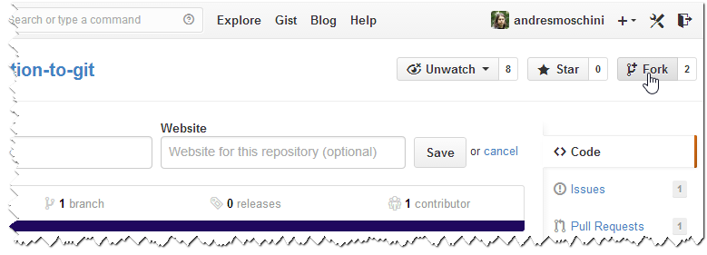

There are a lot of ways to clone one Git remote repository into another. But we 
are  working with GitHub, and they have a nice abstraction in order to maintains 
a kind of hierarchy of parent repository and the forks, it also keeps permissions, 
so if the original repository is private, the child repository too.

To fork a repository you have to find it in GitHub and click on "Fork" button:

	
It will create a full copy of the original repository into your account.

Personal forks are very useful to collaborate open source projects and also to 
have complete freedom to experiment when you are working on a private project.

You can see the official GitHub guide for this topic in <https://help.github.com/articles/fork-a-repo>.

