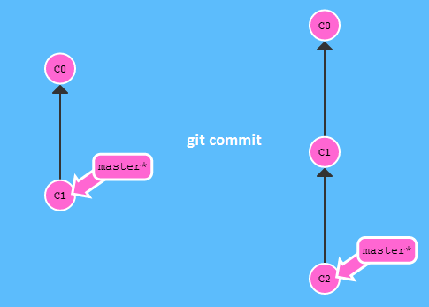

Git is all about composing and saving snapshots of your project and then working 
with and comparing those snapshots. This section will explain the commands 
needed to compose and commit snapshots of your project.

An important concept here is that Git has an 'index', (see [the Index]) which 
acts as sort of a staging area for your snapshot. This allows you to build up a 
series of well composed snapshots from changed files in your working directory, 
rather than having to commit all of the file changes at once.

We can use git status to see what the state of our project is:

    $ git status -s
	
    ?? README
    ?? hello.cs

So right now we have two untracked files. We can now add them.

    $ git add .
	
Now if we run git status again, we'll see that they've been added.

    $ git status -s
	
    A  README
    A  hello.cs

Let's stage and commit all the changes to our hello.cs file. In this first 
example, we'll use the -m option to provide the commit message on the command 
line.

    $ git commit -m 'my hola mundo changes'
	
    [master 68aa034] my hola mundo changes
    2 insertions(+)
	
Now we have recorded the snapshot. If we run git status again, we will see that 
we have a "clean working directory", which means that we have not made any 
changes since our last commit - there is no un-snapshotted work in our checkout 
(see [commit conventions]).

    $ git status

	# On branch master
    nothing to commit (working directory clean)

For example, below we show an image of the prior and subsequent to execute 
the statement:

	
---

Some text extracted from <http://gitref.org/basic/> ([CC BY 3.0](https://github.com/git/git-reference/blob/gh-pages/LICENSE.md))

[the Index]: {{ site.github.url }}/migration-to-git/2-concepts/the-index.html
[commit conventions]: {{ site.github.url }}/migration-to-git/3-working-with-git/commit-conventions.html
