### Doppler - Flow example

This is a little example of the [flow used] in Doppler to develop a feature. The git client used is [GitExtensions]. 

If you are new on Doppler you have to follow the next steps:

1. [Fork the main repository] from [github]

	
	
2.  Clone your previously forked Doppler repository

	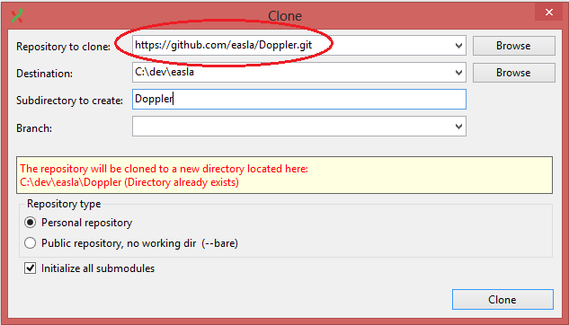

3.  After the clone your local repo should look like this
	
	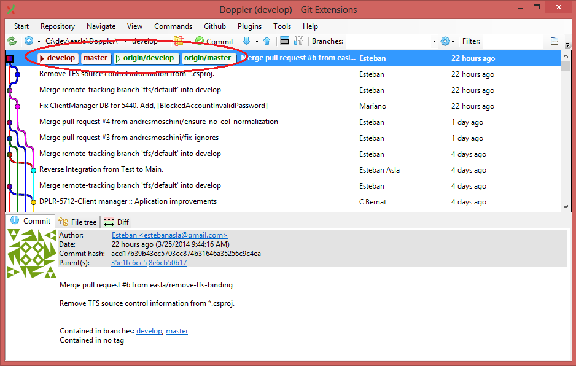

4. Then you have to add a remote repository named `upstream` by convention that is pointing to the main repository of [Doppler]. 

	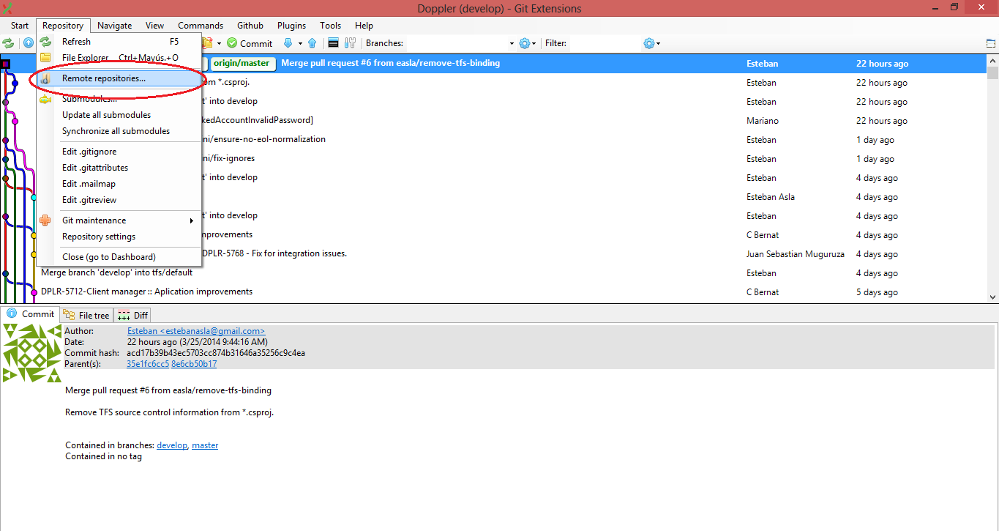
	
	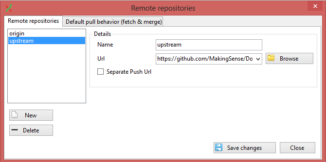

5. Then you have to fetch all the changes from that repository. You can do it with [GitExtensions] using the `fetch all` option or with the console typing `git fetch upstream`

	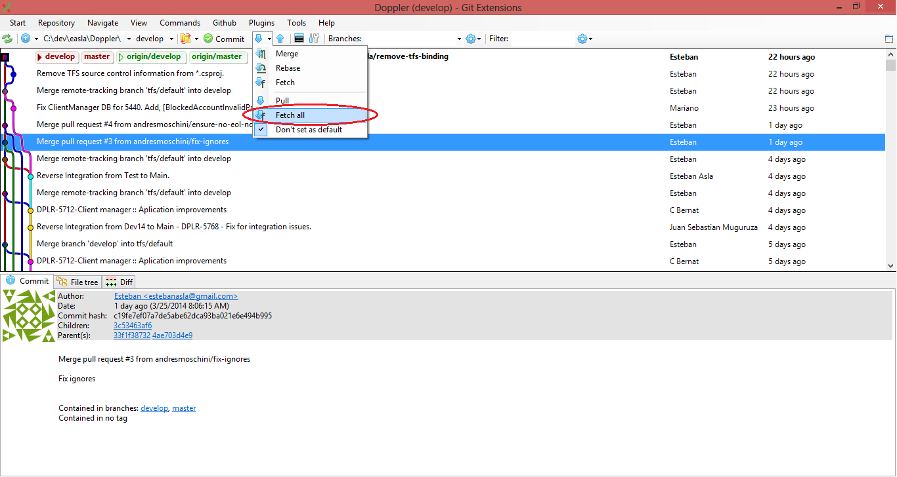

6. This is how your repository will looks like. At this moment  all your branches are pointing to the same commit.

	

7. Now suppose that new changes on the main repository has been merged and you need to "update" your copy to see these changes locally.  Well to do this, you will need to fetch the changes of  upstream again. Because your `upstream/develop` is pointing to a new commit you have to link the two trees. This action could be done using:
    
    * A merge (fast forward). You have to click with the right button on the `upstream/develop` branch and click on the option Merge into current branch. To do this, you have to checkout your local branch develop, in this case
    
	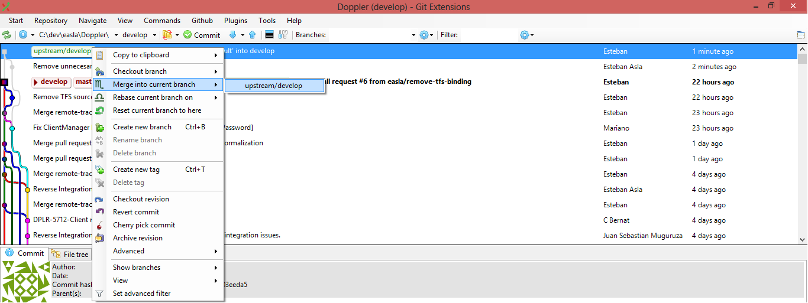
	
	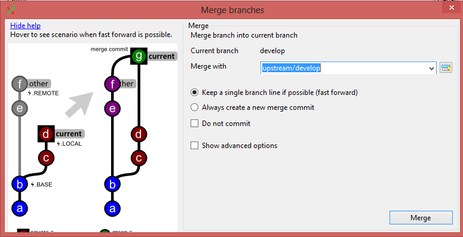

8. If you need to update your remote copy of your repository `origin/develop` (fork) you will need a push to your remote repository

	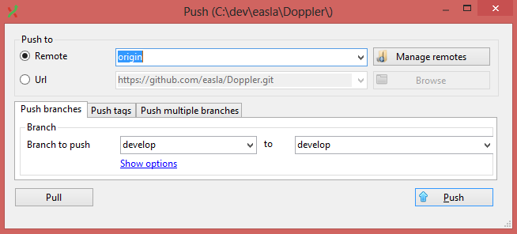
	
9. Your repository will looks like that

	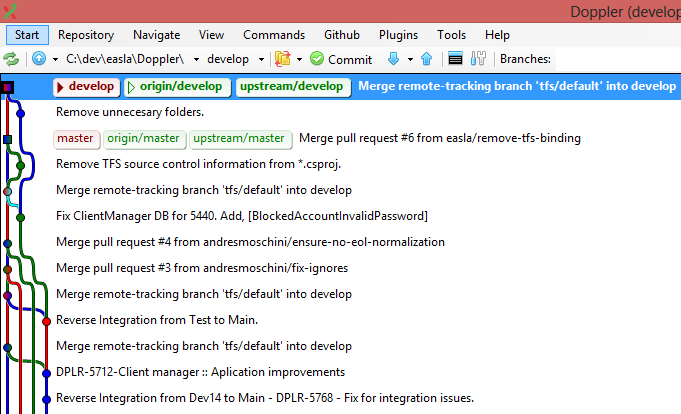
	
10. Now, suppose that you have to start to work on a story of the sprint. To do that and to follow our flow of work, you will need to create a branch with the ID of the issue en Jira and followed by a short name that describes the feature on which you will start to work. For example, for the [DPLR-5783](http://jira.makingsense.com/browse/DPLR-5783) which is a story, you should name the branch DPLR-5783-new-registration-flow. And for this [DPLR-5850](http://jira.makingsense.com/browse/DPLR-5850), which is a bug, we should use something like that DPLR-5850-fix-content-prepaid-plans.
For this action, you don't need to update your local repository (step 7). Only doing a fetch of your upstream, you can create a branch from `upstream/develop` without merge your local repository `develop`. 

	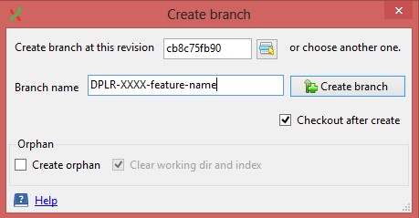
	
	After some commits it will looks like something like this. Take into account that the changes are committed and pushed to. It would be desirable to use commit messages that follow this [http://tbaggery.com/2008/04/19/a-note-about-git-commit-messages.html](http://tbaggery.com/2008/04/19/a-note-about-git-commit-messages.html):
	
	

11. Once your changes are ready to be merged to the main repository, you have to go to [github], to your copy repository (forked), for example, to [https://github.com/easla/Doppler/](https://github.com/easla/Doppler/) and then you have to do a [Pull Request]

	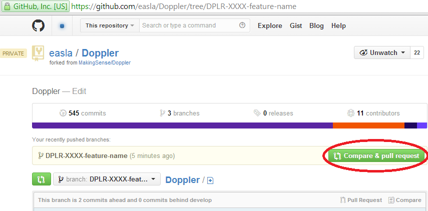
	
	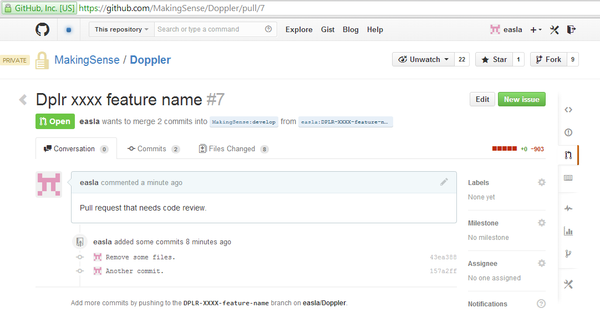
	
12. Then an administrator make a code review, looking the files changes in all commits that compounds the [Pull Request].  Comments on the code can be do for anyone who has access to the Doppler repository. In this case, the administrator reject the [Pull Request] because it contains a disallowed file deletion. 

	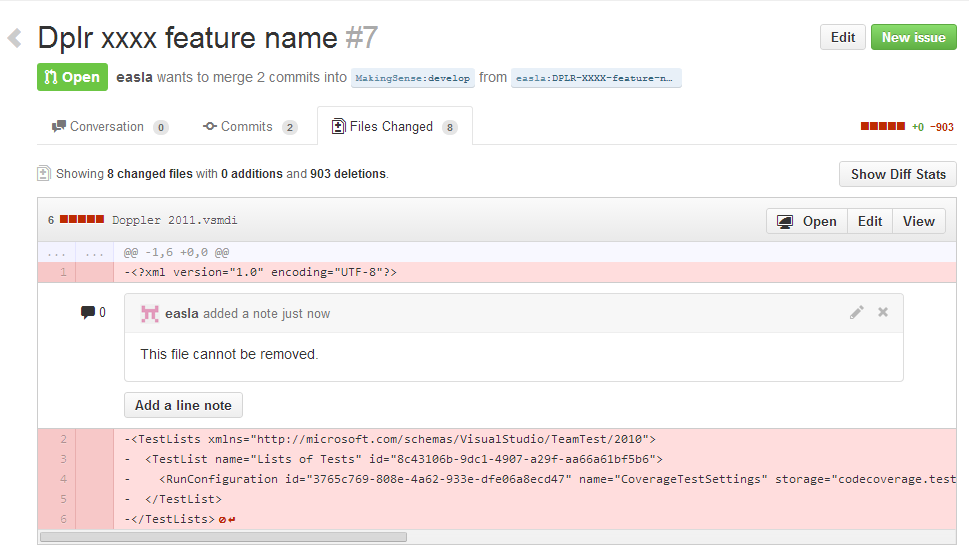
	
	Add the missing file in other commit. The pull request is automatically updated and it will point to the this last commit.
	
	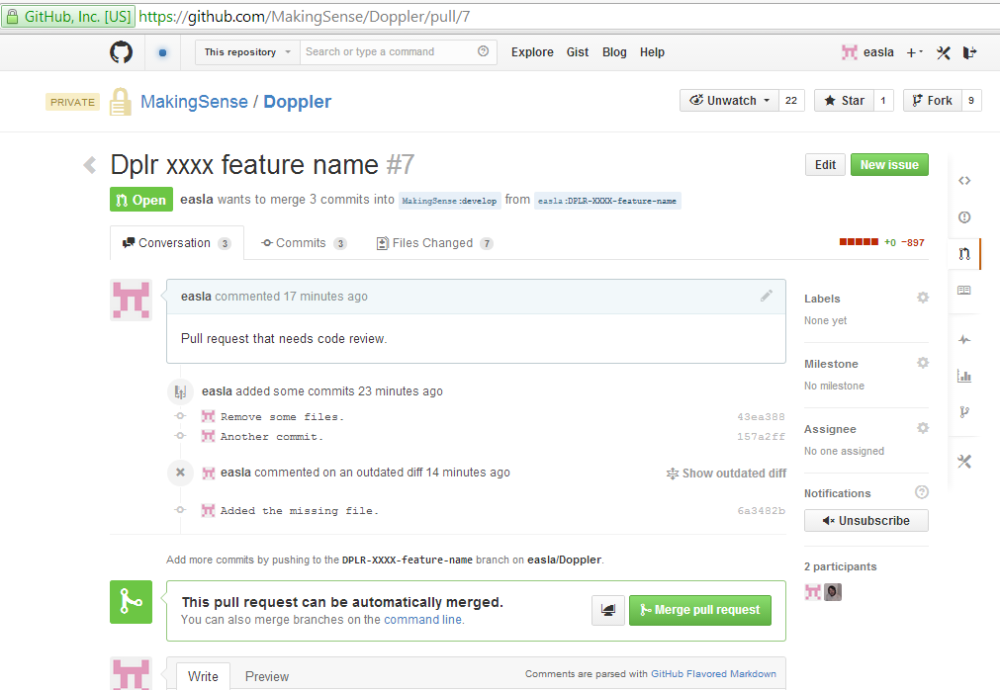
	
13. After the last pushed commit, the administrator of the main repository approves and merge the [Pull Request]. 

[github]: https://www.github.com
[GitExtensions]: https://code.google.com/p/gitextensions/
[Fork the main repository]: http://makingsense.github.io/muigration-to-git/3-working-with-git/fork-a-repo.html
[Doppler]: https://github.com/MakingSense/Doppler.git
[Pull Request]: http://makingsense.github.io/migration-to-git/3-working-with-git/creating-a-pull-request.html
[flow used]: (doppler-flow.html)
