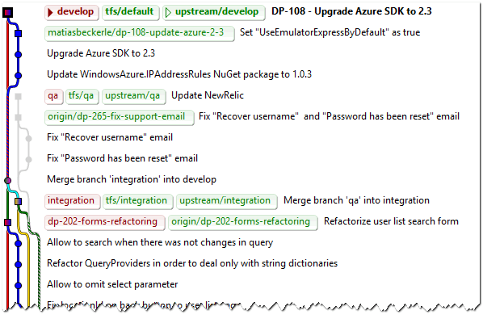

### DP Flow

**_based on [git-flow] and [DCA flow]_**

Our DCA project has been merged with some other projects of the same client, you can find more information about the context and the desired work-flow in [DCA flow] page. The idea is basically the same, but sadly, the client requires TFS, so, we could use Git and GitHub, but each feature branch should be also merged to TFS. It give us a little overhead, but is still better than pure TFS. 

#### Local environment configuration

To support this work-flow you have to download and add to your `path` [git-tfs](http://git-tfs.com/) (at the moment of writing this article, we are using the git-tfs v0.20.0) and [git-helpers](https://github.com/MakingSense/git-helpers#git-helpers).

#### Remote repositories

Our `upstream` repository path is <https://github.com/MakingSense/dca>.

`upstream` branches:

* `develop` associated to `tfs/default` (Trunk)
* `integration` branch associated to `tfs/Integration`
* `qa` branch associated to `tfs/QA`

After a clone of `upstream` you can configure TFS remotes using [bootstrap command](https://github.com/git-tfs/git-tfs/blob/master/doc/commands/bootstrap.md):

```
$ git tfs bootstrap
```

If it doesn't work (it is possible because git-tfs isn't so predictable) you can edit `.git/config`file, it is also useful if the tfs remotes names are not matching desired ones:


Each developer has a fork of `upstream`, and it is refereed in his own local clone as `origin`. If he wants, he could add references to other developers forks in order to be updated about their work or cherry pick some commits.

In developer's forks, there will be stored the features branches.

The result should be something similar to this:



#### Work flow

Sprint `N` starts. In the planning we choose a lot of nice features to implement!

**Steps:**

1. A developer chooses a task or feature to implement from sprint board.

    * If the task is enough large, he can create a sub-task.
    * The task is moved to "in progress" state. 
    * Developer fetches remote Git and TFS repositories trough our self utility function [ffetch](https://github.com/MakingSense/git-helpers#ffetch).
    * Based on `upstream/develop` or `tfs/default` branches, he creates a local branch for the feature (see [create a new branch]). Our convention is:
        * Lowercase
        * No spaces
        * No slashes (`/` nor `\`)
        * Starts with task id
        * Example `dp-260-common-functions-to-utilities`
        
2. Our developer works in the task

    * He tries to commit atomic and meaning changes (see [commit changes]).
    * He tries to keep his changes pushed to his `origin` repository (see [push to a remote repo]).
    * Regularly, he could fetch remotes and merge or rebase his branch in order to keep it update.
	  
3. Task is done

    * Our developer commits and push all his changes to `origin` and creates 
      a _pull request_ to `upstream/develop` (see [creating a pull request]).
    * Some other developers in the team do a quick code review.
    * If something is wrong, discussion can continue in the _pull request_ and fixes can be push to the `origin` _feature_ branch.
    * When the code has been reviewed, and signed off, it could be merge into `tfs/default`

<!--TODO: Continue writing here -->

4. Sprint finishes

<!--TODO: review it -->

    * `upstream/develop` branch is merged to a new _version branch_ in `upstream` repository (see 
      [merge remote branches]).
    * Preparation to production is done in the new _version branch_ updating meta-data like version number, build dates, etc.
    * Sprint `N+1` starts with a planning.

5. QA in _version branch_ branch

<!--TODO: review it -->

    * When the client and QA team detect issues in _version branch_, they are prioritized and some of them cold be included in current sprint `N+1`
    * In order to fix them, our developer creates a new branch, the steps are like in points `1`, `2` and `3` but based on _version branch_ branch in place of `develop`.
    * _version branch_ is fairly often merged to `develop`.
    * When QA stage finish, _version branch_ is merged to _master_.

6. The release!

<!--TODO: review it -->

    * The release date day has arrived, code on `master` is tagged and deployed to production environment.

7. Hurry! A critical issue in Production!

<!--TODO: review it -->

    * If something goes wrong in production, the process to fix it is similar to steps `5` but in place of using a _version branch_, it is done in a new _hotfix branch_ based on `upstream/master` or in the last release tag.

<!--TODO: review it -->

Eventualliy in steps 1, X or Y, developer could detect that `upstream` is not updated to TFS related branch status, so...


[DCA flow]: dca-flow.html
[git-flow]: http://nvie.com/posts/a-successful-git-branching-model/
[repo boilerplate]: {{ site.github.url }}/migration-to-git/3-working-with-git/repo-boilerplate.html
[clone a remote repo]: {{ site.github.url }}/migration-to-git/3-working-with-git/clone-remote-repo.html
[fork a remote repo]: {{ site.github.url }}/migration-to-git/3-working-with-git/fork-a-repo.html
[configure remotes]: {{ site.github.url }}/migration-to-git/3-working-with-git/configure-remotes.html
[fetch remotes]: {{ site.github.url }}/migration-to-git/3-working-with-git/fetch-remotes.html
[create a new branch]: {{ site.github.url }}/migration-to-git/3-working-with-git/create-a-new-branch.html
[commit changes]: {{ site.github.url }}/migration-to-git/3-working-with-git/commit-changes.html
[push to a remote repo]: {{ site.github.url }}/migration-to-git/3-working-with-git/push-to-a-remote-repo.html
[creating a pull request]: {{ site.github.url }}/migration-to-git/3-working-with-git/creating-a-pull-request.html
[working with pull requests]: {{ site.github.url }}/migration-to-git/3-working-with-git/working-with-pull-requests.html
[merge remote branches]: {{ site.github.url }}/migration-to-git/3-working-with-git/merge-remote-branches.html
